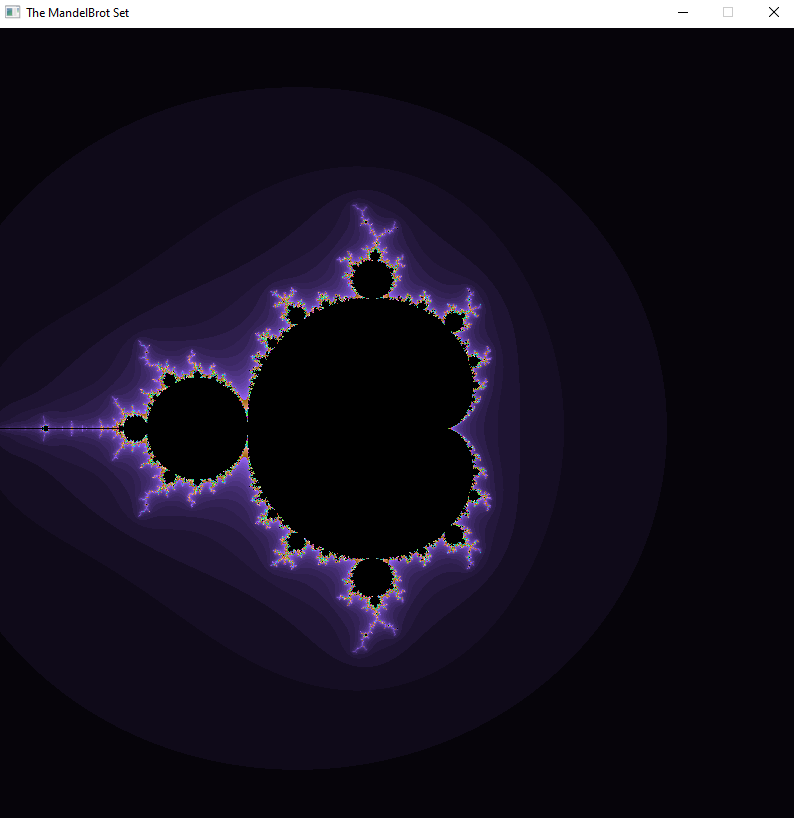

# MandelBrot Set Visualizer
A visualizer built with SDL2 that renders the Mandelbrot set with customizable parameters. 
Will eventually harbor a zooming feature with multi-threaded optimizations in later iterations.

## Usage
Execute the Windows batch file in the scripts folder (after cloning the project) to build the VS Solution.
All code to customize the rendering of the mandelbrot set is located in the Mandelbrot.cpp file
